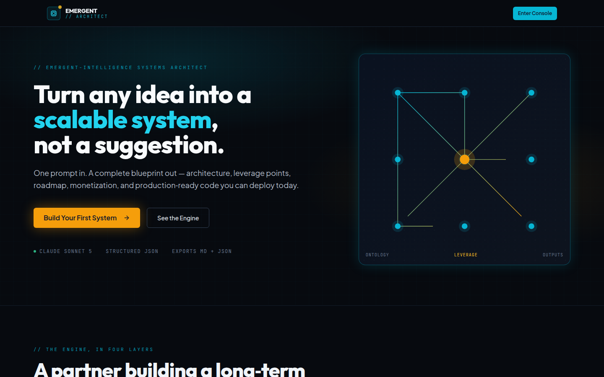
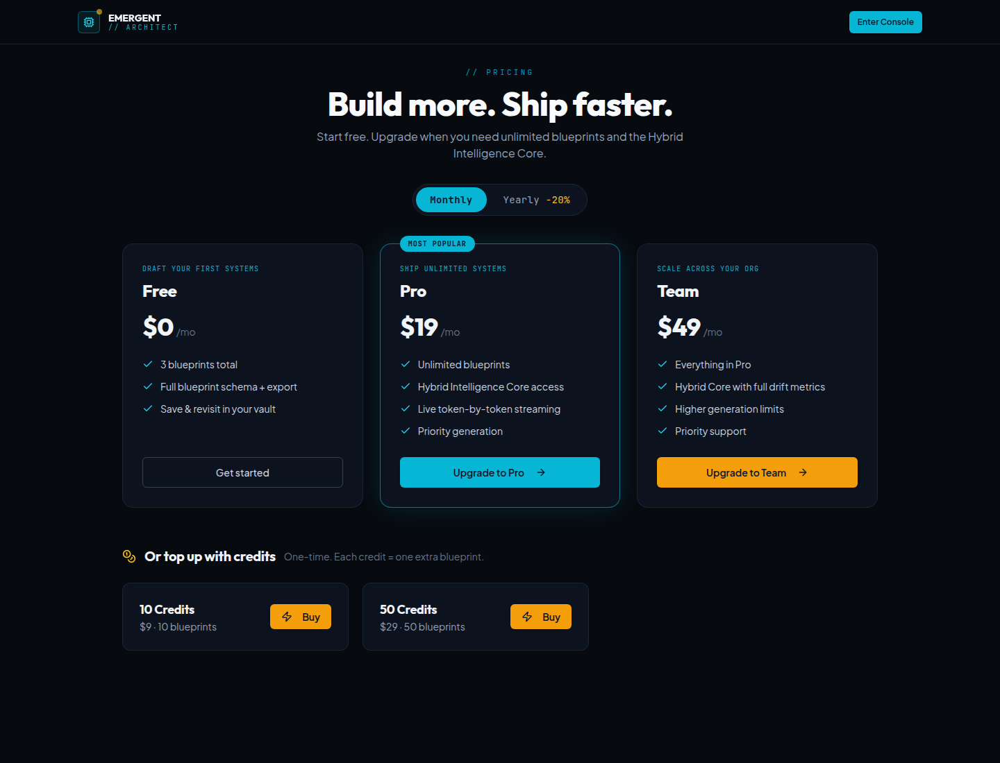

# Emergent // Architect

An emergent-intelligence systems architect: drop in any idea and get back a
complete, scalable system — core insight, system blueprint, leverage points,
roadmap, risks, monetization, and production-ready executable assets.

Built with **FastAPI + React + MongoDB**, powered by a multi-model AI pipeline.

**Live app:** [scalable-ai-forge.emergent.host](https://scalable-ai-forge.emergent.host)

---

## Screenshots

Public pages only — no login required. (Vault/Generator/Dashboard are behind
auth; add those separately once you're signed in.)

| Landing | Pricing |
|---|---|
|  |  |

---

## Features

- **Blueprint Generator** — one prompt in, a full structured system out, from
  **Claude Sonnet 5**. Pro/Team get it streamed token-by-token over SSE; Free
  gets the same real generation via a plain request/response call. Every
  blueprint also reports **funding readiness** (measurable dimensions + named
  gaps, not a binary "fundable" verdict) and **provenance** tags on its major
  sections (Fact / Derived / Proposed / Unverified / Generated) — see
  "Blueprint schema" below.
- **Hybrid Intelligence Core** (`/core`) — a multi-model orchestrator that routes
  each task to the right engine (Claude for strategy, GPT for code, Gemini for
  speed) with canon enforcement and drift monitoring. Returns strict JSON.
  Pro/Team only.
- **Blueprint Vault** — save, search, rename, open and delete blueprints per user.
  `created_at` is a server-generated, immutable timestamp; `updated_at` is
  server-set on every modification. Neither is ever read from the LLM's
  output or accepted from a client (see `backend/timestamps.py`).
- **Export** — copy JSON, download `.md` / `.json`.
- **Auth** — email/password with JWT.
- **Generation priority** — Free, Pro and Team each draw from their own
  concurrency ceiling (`backend/generation_gate.py`), so Pro/Team generation is
  never delayed by Free-tier load, and Team's ceiling is higher than Pro's.
- **Billing (Stripe)** — Free / Pro / Team subscriptions (monthly + yearly) and
  one-time blueprint credit packs, with feature gating.

## Blueprint schema

Each generated blueprint (`backend/server.py::ARCHITECT_SYSTEM_PROMPT`) is
strict JSON with these top-level sections: `title`, `tagline`, `core_insight`,
`system_blueprint`, `leverage_point`, `roadmap`, `risks`, `monetization`,
**`funding_readiness`**, `executable_output`, **`provenance`**.

`funding_readiness` reports 7 measurable dimensions (technical readiness,
market evidence, revenue evidence, defensibility, capital requirements,
deployment readiness, founder-execution evidence), each with what evidence
exists and what gap remains — the model is explicitly instructed never to
assert a business "is fundable" or "is not fundable"; that's an external,
evidence-based judgment it has no basis to make from an idea description
alone.

`provenance` tags each major section's claim origin with one of five labels:
`Fact` (restates the user's own input), `Derived` (this system's analysis),
`Proposed` (a recommendation the user hasn't validated), `Unverified` (a
claim about the outside world needing external evidence), `Generated` (a
literal AI-produced artifact). Implemented at the schema/generation layer;
frontend rendering for it is a follow-up pass (see "Known issues" below).

## Known issues

- **Frontend production build is broken**, independent of any change in this
  repo: `ajv-keywords@5.1.0` (pulled in via `react-scripts` →
  `terser-webpack-plugin` → `schema-utils`) requires `ajv@^8.8.2`, but the
  resolved top-level `ajv` is `6.15.0` — neither `npm install --legacy-peer-deps`
  nor a clean `yarn install` (the package's own declared `packageManager`)
  changes that resolution. `yarn build` / `npm run build` fail with
  `Cannot find module 'ajv/dist/compile/codegen'`. **`yarn start` (dev
  server) is unaffected** — that code path doesn't load `terser-webpack-plugin`
  — which is how the screenshots above were captured. Needs a real dependency
  fix (most likely an `ajv` entry in `package.json`'s `resolutions`, verified
  against the whole build+start+test matrix) before any frontend UX work
  ships a production build.

## Plans & gating

| Plan  | Price            | Blueprints | Hybrid Core |
|-------|------------------|------------|-------------|
| Free  | $0               | 3 total    | ✗           |
| Pro   | $19/mo · $182/yr | Unlimited  | ✓           |
| Team  | $49/mo · $470/yr | Unlimited  | ✓           |

Free users who hit the limit can buy one-time credit packs (10 for $9, 50 for
$29) — each credit unlocks one extra blueprint.

---

## Tech stack

- **Frontend:** React, React Router, Tailwind CSS, shadcn/ui, native SSE.
- **Backend:** FastAPI, Motor (async MongoDB), JWT, bcrypt.
- **AI:** `emergentintegrations` bridging Claude Sonnet 4.5/5, GPT-5.2, Gemini 3 Flash.
- **Payments:** Stripe (claimable sandbox).

## Project layout

```
/app
├── backend/
│   ├── server.py        # Auth, blueprints, SSE streaming, quota gating
│   ├── core.py          # Hybrid Intelligence Core (multi-model orchestrator)
│   ├── payments.py      # Stripe checkout, webhook, entitlements, billing config
│   ├── setup_stripe.py  # Idempotent Stripe catalog (products + prices)
│   └── requirements.txt
└── frontend/
    └── src/
        ├── pages/       # Landing, AuthPage, Dashboard, Generator, BlueprintDetail,
        │                #   CorePage, Pricing, PaymentSuccess, PaymentCancel
        ├── components/  # Header + core/ pipeline components + shadcn ui
        ├── context/     # AuthContext
        └── lib/         # api.js (axios), stream.js (SSE)
```

## Environment

Backend (`backend/.env`):

```
MONGO_URL=...
DB_NAME=...
JWT_SECRET=...
EMERGENT_LLM_KEY=...
STRIPE_SECRET_KEY=...
STRIPE_PUBLISHABLE_KEY=...
STRIPE_ACCOUNT_ID=...
STRIPE_WEBHOOK_SECRET=...
STRIPE_MODE=test
```

Frontend (`frontend/.env`):

```
REACT_APP_BACKEND_URL=...
```

## Running locally

Services are supervisor-managed.

```bash
sudo supervisorctl restart backend
sudo supervisorctl restart frontend
python backend/setup_stripe.py   # (re)sync the Stripe catalog
```

## Key API endpoints

| Method | Path                              | Notes                          |
|--------|-----------------------------------|--------------------------------|
| POST   | `/api/auth/register` / `login`    | JWT auth                       |
| GET    | `/api/auth/me`                    | Current user (plan + credits)  |
| POST   | `/api/blueprints/stream`          | SSE token-by-token generation  |
| GET/PATCH/DELETE | `/api/blueprints/{id}`  | Vault CRUD                     |
| POST   | `/api/core/run`                   | Hybrid Core (Pro/Team only)    |
| GET    | `/api/billing/config`             | Public pricing config          |
| GET    | `/api/billing/me`                 | Usage + entitlement            |
| POST   | `/api/payments/checkout`          | Create Stripe Checkout session |
| GET    | `/api/payments/status/{id}`       | Poll payment status            |
| POST   | `/api/stripe/webhook`             | Stripe webhook (idempotent)    |

## Stripe

Uses a **claimable sandbox** — no account or keys required to test. Test card:
`4242 4242 4242 4242`, any future expiry, any CVC. Claim the account later to go
live; keys switch automatically on deploy after KYC.
